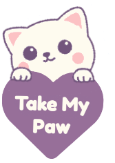

# Take my paw
### *built by* Team Hello Kitties (Mourad, Ryan, Andrés, Ayesha and Chiara)

This web app provides users the experience to match prospective pet adopters with their furrever pet through an interactive personality quiz. It will then match to an ideal pet to adopt from a cat shelter.

## Installation, Running the server & Usage

### Installation

- Clone both the client repo (https://github.com/MCXpak/hello-kitties-client.git) and the server repo (https://github.com/MCXpak/hello-kitties-server.git).
- Make sure you have Node & NPM installed.

### Running the server

Make sure you are in ./server folder and run `npm run start`. If you want to stop the server simply press Ctrl+c.

### Usage 

The app currently uses a local host, just open the client folder and click on index.html - the landing page - which will open up in your browser. From there you can walk through:

1. quiz.html 
The quiz - either clicking on the paw or the navbar.
2. matching.html
After taking the quiz, you will be redirected to your matched cats where you can either save your preferences or reject them.
3. saved.html
Clicking on the 'Saved pets' button will redirect to your saved preferences.
4. singlecat.html 
Clicking on a single pet name will redirect to a single cat page.
5. allcats.html 
'Our cats' in the navbar will show all the cats available and their description. 
6. helppage.html
'How can I help' in the navbar will redirect to the first additional feature.
7. calendar.html
'Calendar' in the navabar will redirect to the second additional feature where you can book a workshop.

## Technologies

- HTML
- CSS
- JavaScript
- Express
- GSAP

